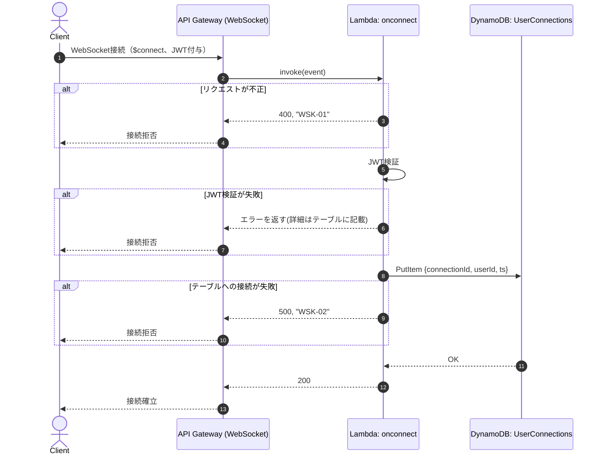
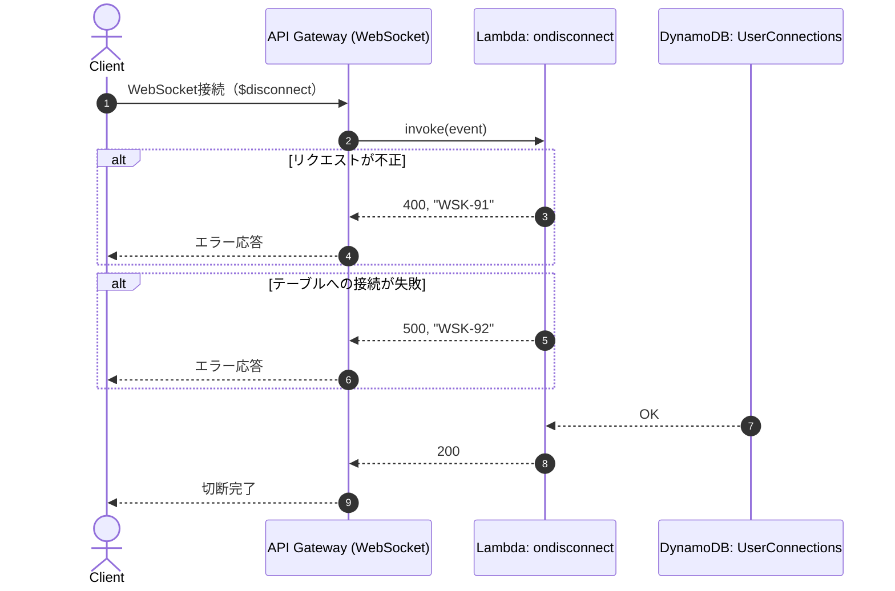
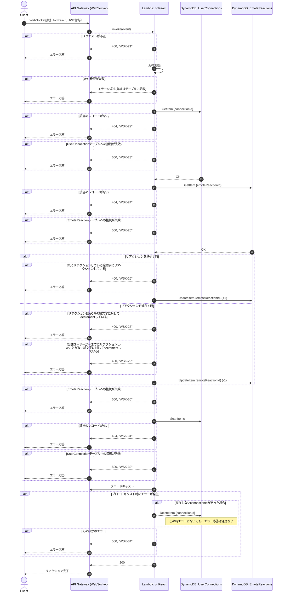
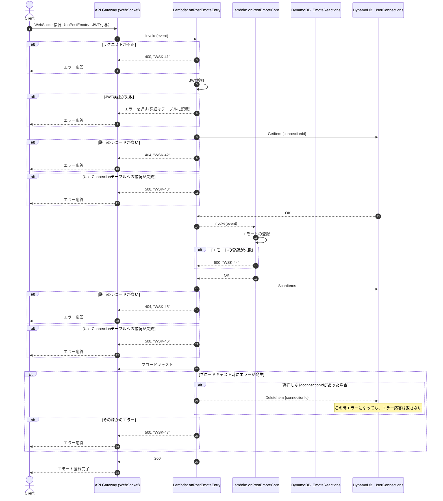
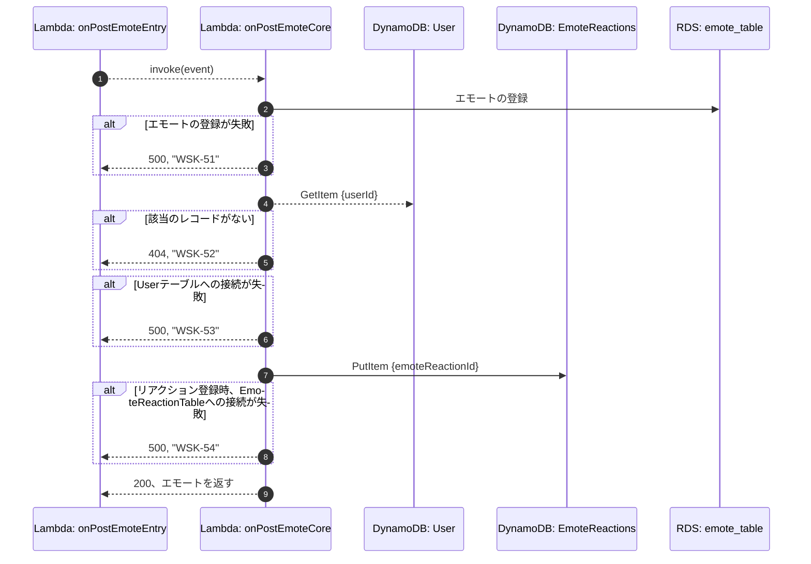

# wordless-backend-websocket-api

## リポジトリの概要

本リポジトリは Wordless のリアルタイム通信を担う WebSocket API のバックエンド実装です。
構成は、 **API Gateway(WebSocket) + AWS Lambda(Node.js)** です。

プロジェクトの概要は [フロントエンドリポジトリ](https://github.com/kagamaru/wordless-client) のREADMEをご覧ください

## リポジトリの技術要素

| 実現機能            | パッケージ名                              | バージョン |
| ------------------- | ----------------------------------------- | ---------- |
| IaC、デプロイメント | [serverless](https://www.serverless.com/) | 4.18.2     |
| テスト              | [jest](https://jestjs.io/)                | 29.7.0     |
| 日付変換            | [dayjs](https://day.js.org/)              | 1.11.13    |
| コードの静的解析    | [eslint](https://eslint.org/)             | 9.17.0     |
| コードフォーマット  | [prettier](https://prettier.io/)          | 3.4.2      |

## 採用理由

### AWS Lambda + API Gateway

- サービスが小さいうちは、常時起動しているサーバーを用意するよりコストが安く済むと考え採用。
- API Gateway + AWS Lambda の構成は AWS でアプリケーションを作る上ではよく紹介される構成であり、参考資料も多いのではないかと考えた。
- また、API Gateway では、サービス選択時に今回実装したような WebSocket API を選択でき、過去に実装経験のない WebSocket API の実装が容易になるのではないかと考えた。
- サービスが大きくなってきたら、API Gateway + AWS Lambda の構成ではなく、アプリケーションサーバを立てられる何らかの PaaSサービス を採用することを検討する。

### WebSocket API

- WordlessのようなSNSアプリでは、リアルタイム通信が必要になるため採用。
- API Gateway では、WebSocket API を選択できるため、その流れで自然に採用できた。

### DynamoDB

- 規模が小さいアプリケーションであれば、NoSQL のデータベースである DynamoDB でデータの保管については事足りると考えたため採用。
- 並び替えのロジックが必要なエモートの投稿のみ、RDS で管理している。
- aws-sdk-client-mock で容易にmock化できるためテストが実施しやすい。

### Node.js + TypeScript

- isomorphic なコードを書けるため、フロントエンドリポジトリと同じ言語を採用。
- `@types` の中は、フロントエンドリポジトリと同じコードも多く、開発の中で恩恵を感じた。

### Serverless Framework

- プレーンな AWS CloudFormation の設定よりもシンプルな設定が出来るため採用。
- DynamoDB の設定も yml で記載できるため、テーブルの作成も容易である。

### jest

- javascript のテストフレームワークの中で、最もメジャーなものを採用。
- フロントエンドでは vitest を採用しているものの、jest を採用しているプロジェクトも依然多く、習熟する必要があるとも考えた。
- 歴史が古く、設定が複雑になりやすいのが欠点である。

## 工夫した点

| 課題 / Before                                                                                      | 解決策 / After                                                                                                                  | 効果                                                                              |
| -------------------------------------------------------------------------------------------------- | ------------------------------------------------------------------------------------------------------------------------------- | --------------------------------------------------------------------------------- |
| RDS を VPC 内に配置すると VPC 外からアクセス不可。NAT Gateway を用意すれば解決できるがコストが高い | VPC 内に RDS 接続専用 Lambda (`onPostEmoteCore`) を配置し、VPC 外の Lambda (`onPostEmoteEntry`) から `invokeCommand` で呼び出す | NAT Gateway 不要構成を実現し、コスト削減                                          |
| DynamoDB I/O や JWT 検証など、障害時に見逃せない処理をテストで完全に担保する必要があった           | `$connect/$disconnect`, `verifyToken`, `verifyUserConnection` などクリティカル処理は **100% カバレッジ** を達成                 | 品質を担保しつつ、障害検知力を強化（全体でも Statements 98.38% など高水準を維持） |
| 環境ごとに異なる値を手動で設定していたため、設定ミスやヒューマンエラーのリスクがあった             | `serverless.yml` で `${sls:stage}` と `custom:` を利用し、`offline` / `dev` / `prod` で自動切替可能にした                       | 環境変数の管理を自動化し、デプロイ作業を効率化・安全化                            |

## 今後の展望

- 認証方式の変更
    - 本APIでは、リクエストの中にJWTトークンを加え、エモートリアクション-登録APIおよび、エモート-投稿APIが実行たびに認証している
    - ただ、JWTトークンは窃取することにより、ユーザーの認証情報を盗んで好きに操作することが可能であり、現在の実装方法はセキュリティ上の懸念を抱えている
    - 上記のような設計になっている背景には、API Gateway でデフォルトで提供されている認証手段が関係している。API Gateway では、Authorization ヘッダー + JWTトークン(ブラウザのlocalStorageに保管)という認証方法が提供されている。この方法は、手軽に実装できるものの、XSS攻撃に対して脆弱である。
        - 本サービスでは開発コスト削減を目的として、上記の方法を採用しているため、JWTトークンをlocalStorageに文字列として保管している。その結果、文字列として保管されているトークンを、リクエストのたびに送付するという力押しに近い方法になっている。
    - WebSocket API の認証について、どのようなベストプラクティスがあるかは今後調査、比較検討が必要である。
- emoteReactionId と emoteId を統一
    - 現在、`emoteReactionId` と `emoteId` はそれぞれ独立して管理されているが、どちらも同じ「エモート」1つに紐づくものであるため、統一することが可能である
    - 大幅なスキーマ変更であるため、今回はリファクタリングを見送ったものの、今後時間を作って実装していきたい
- リアクション時のプッシュ通知の実装
    - 多くのSNSアプリケーションには、リアクション時にプッシュ通知を飛ばす機能が実装されている
    - 本機能はSNSのリアルタイム性を支えており、ユーザー体験の向上に寄与すると考えられるため、今後実装していきたい
    - 実装方法としては、エモートリアクション-投稿APIの実行時に、リアクションをしたユーザーのユーザーIDを取得し、エモートの投稿者にプッシュ通知を飛ばすことが考えられる。

## シーケンス図

### コネクション-確立 API

#### 処理フロー

#### エラー一覧

| エラーコード | ステータス | 条件                              |
| ------------ | ---------- | --------------------------------- |
| WSK-01       | 400        | connectionId/Authorization が不正 |
| WSK-02       | 500        | UserConnectionTableへの接続が失敗 |
| AUN-01       | 500        | 署名鍵の取得が失敗                |
| AUN-02       | 401        | JWTの検証が失敗                   |
| AUN-03       | 401        | 署名鍵が見つからない              |

### コネクション-切断 API

#### 処理フロー

#### エラー一覧

| エラーコード | ステータス | 条件                              |
| ------------ | ---------- | --------------------------------- |
| WSK-91       | 400        | connectionId が不正               |
| WSK-92       | 500        | UserConnectionTableへの接続が失敗 |

### エモートリアクションー投稿 API

#### 処理フロー

#### エラー一覧

| エラーコード | ステータス | 条件                                                                            |
| ------------ | ---------- | ------------------------------------------------------------------------------- |
| WSK-21       | 400        | connectionId/Authorization が不正、存在しないIDの絵文字が使用されている         |
| WSK-22       | 404        | コネクション検証時、指定されたIDのコネクションが存在しない                      |
| WSK-23       | 500        | コネクション検証時、UserConnectionTableへの接続が失敗                           |
| WSK-24       | 404        | リアクション取得時、指定されたIDのリアクションが存在しない                      |
| WSK-25       | 500        | リアクション取得時、EmoteReactionTableへの接続が失敗                            |
| WSK-26       | 400        | リアクション済の絵文字に対してincrementしている                                 |
| WSK-27       | 400        | リアクション数が0件の絵文字に対してdecrementしている                            |
| WSK-29       | 400        | 当該ユーザーが今までにリアクションしたことがない絵文字に対してdecrementしている |
| WSK-30       | 500        | リアクション登録時、EmoteReactionTableへの接続が失敗                            |
| WSK-31       | 404        | userConnection全件取得時、指定されたIDのコネクションが存在しない                |
| WSK-32       | 500        | userConnection全件取得時、UserConnectionTableへの接続が失敗                     |
| WSK-33       | -          | 存在しないuserConnection削除時、UserConnectionTableへの接続が失敗               |
| WSK-34       | 500        | ブロードキャスト時にエラーが発生                                                |
| AUN-01       | 500        | 署名鍵の取得が失敗                                                              |
| AUN-02       | 401        | JWTの検証が失敗                                                                 |
| AUN-03       | 401        | 署名鍵が見つからない                                                            |

### エモート-投稿 API

#### onPostEmoteEntry

##### シーケンス図

#### エラー一覧

| エラーコード | ステータス | 条件                                                                                               |
| ------------ | ---------- | -------------------------------------------------------------------------------------------------- |
| WSK-41       | 400        | リクエストのフィールドが不正、終端の絵文字の後にも絵文字が存在する、IDが不正な絵文字を使用している |
| WSK-42       | 404        | コネクション検証時、指定されたIDのコネクションが存在しない                                         |
| WSK-43       | 500        | コネクション検証時、UserConnectionTableへの接続が失敗                                              |
| WSK-44       | 500        | onPostEmoteCoreでエラー                                                                            |
| WSK-45       | 404        | userConnection全件取得時、指定されたIDのコネクションが存在しない                                   |
| WSK-46       | 500        | userConnection全件取得時、UserConnectionTableへの接続が失敗                                        |
| WSK-47       | 500        | ブロードキャスト時にエラー                                                                         |
| WSK-48       | -          | 存在しないuserConnection削除時、UserConnectionTableへの接続が失敗                                  |
| AUN-01       | 500        | 署名鍵の取得が失敗                                                                                 |
| AUN-02       | 401        | JWTの検証が失敗                                                                                    |
| AUN-03       | 401        | 署名鍵が見つからない                                                                               |

#### onPostEmoteCore

##### シーケンス図

##### エラー一覧

| エラーコード | ステータス | 条件                                                   |
| ------------ | ---------- | ------------------------------------------------------ |
| WSK-51       | 500        | エモートの登録が失敗                                   |
| WSK-52       | 404        | ユーザー情報取得時、指定されたIDのユーザーが存在しない |
| WSK-53       | 500        | ユーザー情報取得時、UserTableへの接続が失敗            |
| WSK-54       | 500        | リアクション登録時、EmoteReactionTableへの接続が失敗   |

## コンタクト

- [GitHub履歴書](https://github.com/kagamaru)

## 環境変数の一覧

| 環境変数名                  | 説明                                       |
| --------------------------- | ------------------------------------------ |
| LAMBDA_SECURITY_GROUP_ID    | Lambda のセキュリティグループID            |
| VPC_PUBLIC_SUBNET_ID_A      | VPC のパブリックサブネットID(Lambda接続用) |
| VPC_PUBLIC_SUBNET_ID_B      | VPC のパブリックサブネットID(Lambda接続用) |
| DB_HOST                     | RDS のホスト                               |
| DB_USER                     | RDS のユーザー名                           |
| DB_PASSWORD                 | RDS のパスワード                           |
| DB_NAME                     | RDS のデータベース名                       |
| COGNITO_USER_POOL_ID        | Cognito のユーザープールID                 |
| COGNITO_REGION              | Cognito のリージョン                       |
| WEBSOCKET_ENDPOINT          | API Gateway のエンドポイント               |
| POST_EMOTE_CORE_LAMBDA_NAME | エモート-投稿APIのLambda関数名             |
| MY_AWS_REGION               | 使用しているAWS のリージョン               |
